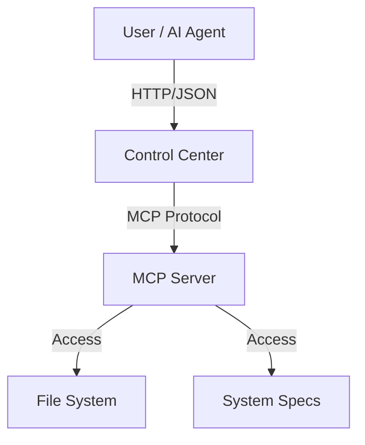

# MCPSOIDS


> **MCPSOIDS** is the definitive "Active Robustness" implementation of the Model Context Protocol. It combines a hardened Node.js MCP server with an avant-garde, glassmorphic Control Center for real-time monitoring and tool execution.

---

## 💎 The Vision

MCPSOIDS moves beyond simple "chat bot tools" to create a governed, observable ecosystem creates a bridge between AI agents and local system operations.

- **Visual Dominance**: A "Cyberpunk Glassmorphism" UI that makes monitoring system health a visual delight.
- **Production Hardened**: Built with rate limiting, error boundaries, and strict type safety.
- **Dual Architecture**: Decoupled Backend (Server) and Frontend (Control Center) for maximum scalability.

## 🚀 Key Features

### 🧠 Backend (The Cortex)

- **Full MCP Compliance**: Implements the standardized protocol for tool discovery and execution.
- **Native Tools**:
  - 📂 **File System**: `list_directory`, `read_file`, `write_file` (sandboxed).
  - 📊 **System**: `memory_usage`, `ping`.
- **Safety First**: Built-in rate limiting and origin validation.

### 👁️ Control Center (The Eye)

- **Next.js 16 (Turbopack)**: Blazing fast performance.
- **Real-time Telemetry**: Polls server health and connection status.
- **Interactive Tool Catalog**: Execute tools directly from the UI with stricter JSON validation.
- **Avant-Garde Design**: Tailwind CSS v4 driven aesthetics.

---

## ⚡ Quick Start

### Windows (Automatic)

We provide a unified launcher for Windows users.

```powershell
.\start_production.ps1
```

This will automatically:

1.  Boot the **MCP Server** (Port 3000).
2.  Launch the **Control Center** (Port 3001).
3.  Open the necessary terminal windows.

### Manual Setup

**1. The Server**

```bash
cd mcp_server_ref
bun install
bun run build
$env:MCP_AUTH_TOKEN = "local-mcp-token"
node bin/mcp-server-ref.js --enable-fs --cors-origin http://localhost:3001
```

**2. The Control Center**

```bash
cd mcp-control-center
bun install
bun run build
$env:MCP_SERVER_URL = "http://127.0.0.1:3000"
$env:MCP_AUTH_TOKEN = "local-mcp-token"
$env:MCPSOIDS_ADMIN_TOKEN = "local-admin-token"
$env:MCPSOIDS_UI_SECRET = "local-ui-secret"
$env:MCPSOIDS_ALLOW_PRIVATE_MCP = "true"
bun run start -- -p 3001
```

---

## 🛠️ Architecture



## 📦 Tech Stack

- **Runtime**: Node.js v20+
- **Framework**: Next.js 16.0.8 (React 19)
- **Language**: TypeScript 5.x
- **Styling**: Tailwind CSS 4 + Framer Motion
- **Testing**: Playwright (E2E)

## 📄 License

This project is licensed under the Apache License 2.0. - see the `package.json` file for details.

---

_Est. 2026 // LehroSolutions // Advanced Agentic Operations_

## License

Copyright © 2026 Lehro Solutions. Licensed under the [Apache License 2.0](LICENSE). See [NOTICE](NOTICE).

## Documentation

Canonical docs hub: [`docs/.docs/index.md`](docs/.docs/index.md)

## Install

```bash
bun install
bun run build
bun run start
```

See [INSTALL.md](INSTALL.md).

## How to use

See [docs/how-to-use.md](docs/how-to-use.md) for the full operator guide.

## Security

See [SECURITY.md](SECURITY.md).

<!-- docs-system:start -->

## Documentation

The current public documentation is available in [`docs/index.html`](docs/index.html). Start with [`docs/current/start-here.md`](docs/current/start-here.md) for scope, current changes, workflows, architecture, security, quality, and contribution guidance.

### Latest public changes

- Operator control center
- Health, metrics, audit integrity, and capability catalog
- Roots security laboratory and live tool execution

Documentation is maintained as canonical Markdown plus generated HTML and JSON counterparts. Run `pnpm docs:build` after changing `docs/current/*.md` and `pnpm docs:check` before a public release.
<!-- docs-system:end -->

<!-- bun-toolchain:start -->

## Bun and CI

This repository uses **Bun 1.3.14** and targets **Node 24+** for JavaScript tooling and CI.

```bash
rm -f package-lock.json
bun install
bun run build
bun run test
bun run docs:check
```

Do not use `npm ci`; Bun is the canonical install path. Run `bun install` after dependency changes and commit the resulting `bun.lock`.
<!-- bun-toolchain:end -->
